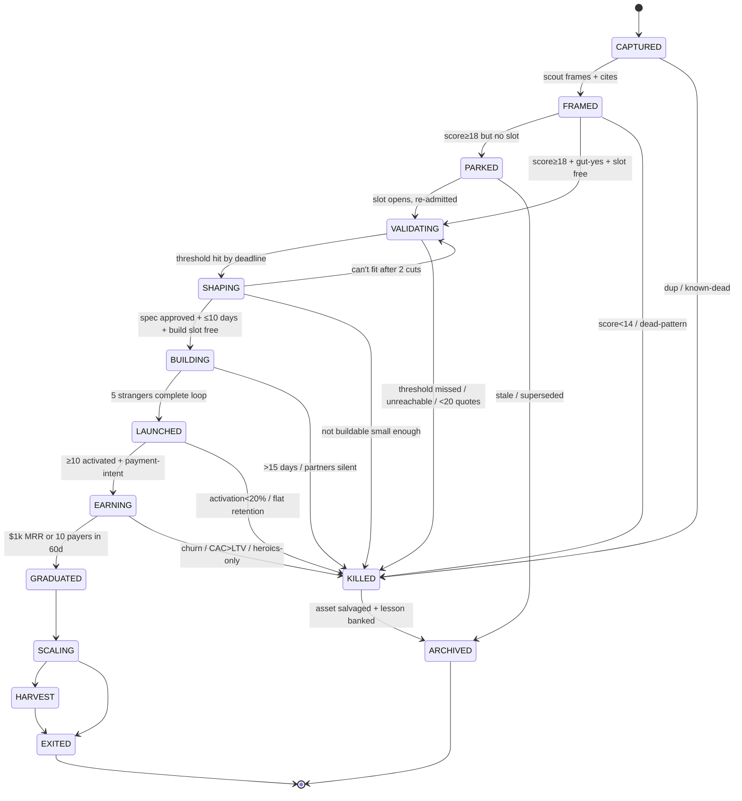
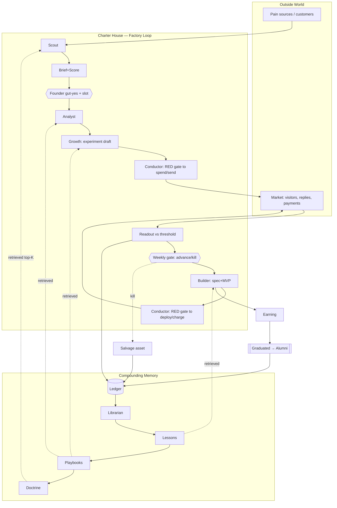

# CHARTER HOUSE — The Operating Model
### Canonical architecture specification · v2 · pre-implementation

> Author: Chief Architect. Audience: the Founder, and later Claude Code (or any harness) for implementation.
> Scope: the **operating model** — what Charter House is, how it thinks, operates, moves ventures, makes decisions, and compounds knowledge. No code, no prompts, no repo files, no tooling depth. All accepted audit recommendations (model/provider abstraction, neutral agent specs, routing, memory retrieval, OpenCode-first, local/cloud hybrid, future-proofing) are treated as settled substrate and not re-argued.
> Test of success: a person can draw Charter House on a whiteboard from this document and explain how a raw idea becomes a graduated venture — and where every dollar, deploy, and message is authorized.

---

# PART 1 — What Charter House Is (The Founding Doctrine)

> *This is the one page. Everything else in this document is downstream of it. If a later decision contradicts this page, this page wins.*

**Mission.** Convert a solo founder's attention into validated, revenue-earning software ventures — repeatedly, cheaply, and without betting the house on any single idea, model, provider, or tool.

**Purpose.** Charter House is not a product and not an agent. It is a **machine for buying real-world signal cheaply and turning dead ideas into permanent assets.** Individual ventures are expendable; the machine and its compounding knowledge are not.

**Philosophy.**
1. *Signal is the only scarce input.* Ideas and code are abundant and nearly free. Replies, visitors, signups, and payments are scarce. The machine exists to acquire signal at the lowest possible cost per verdict.
2. *The founder's attention is the only scarce internal resource.* Not compute, not models, not code. The architecture's prime directive is to spend founder-attention only where judgment is irreplaceable.
3. *The machine compounds; ventures don't have to.* Every venture, alive or dead, must deposit a reusable asset — a lesson, dataset, audience, channel, or template — into shared memory.
4. *Discipline beats cleverness.* Hard gates, WIP limits, and binary verdicts are the moat. They are deliberately rigid because rigidity is what a solo operator lacks under emotional load.

**Operating principles.**
- **Ventures earn progression.** Nothing advances by default or by optimism; it advances by passing an explicit gate with evidence.
- **AI proposes, the founder disposes, the engine enforces.** No capability ever decides; it only recommends.
- **Cheapest-kill-first.** For every idea, design the cheapest experiment that could *end* it before designing anything that could grow it.
- **One source of truth, many views.** An append-only ledger is reality; boards, pipelines, and metrics are disposable projections of it.
- **The substrate is replaceable; the doctrine is not.** Models, providers, and harnesses are configuration. This page is not.

**Constraints.**
- One human operator. Time-zone: India (structural advantage for US-morning / EU-afternoon coverage).
- Near-zero standing budget; every real-money outflow is a deliberate, gated act.
- Global software sales via merchant-of-record; no US entity assumed.
- The system must keep functioning if any model, provider, or harness vanishes overnight.

**Non-negotiable rules.**
1. **No money moves, no code deploys to production, and no real person is contacted without explicit founder authorization.** Ever. By any capability. For any reason.
2. **WIP limits are absolute:** ≤3 ventures validating, ≤1 building, at any instant. A slot opens only when a venture graduates or dies.
3. **Every kill banks an asset.** A kill with no salvaged asset is a process failure, not just a dead idea.
4. **Decisions to advance or kill happen only at the weekly gate — never mid-week, never emotionally.**
5. **Inconclusive = fail.** Weak signal is a result, not a reason to wait.
6. **Secrets and customer PII never enter the shared ledger or leave local storage unless explicitly flagged shareable.**

---

# PART 2 — The Correct Core Abstraction

### 2.1 The question
The Forge made **agents** the primary abstraction (Scout/Analyst/Builder/Growth/Ops). I am rejecting that as the *organizing* primitive. Agent-centric design answers "who does work?" but leaves the three questions that actually matter — *where is each venture, what is it allowed to do next, and who authorized it* — implicit and unenforceable. That is exactly the wrong trade for a governed, gated, solo-operated factory.

### 2.2 Evaluation of the candidate paradigms

| Paradigm | What it makes primary | Strength | Why it fails as the core here |
|---|---|---|---|
| **Agent-centric** | The worker | Natural for open-ended assistance | State lives inside agents; no home for gates, WIP, or governance; sprawls; fragile to model/harness change |
| **Pipeline** | Linear stages | Simple to picture | Ventures loop, branch, and regress (re-validate after a pivot); a straight pipe lies about reality |
| **Planner/Executor** | A goal-decomposing planner | Great for novel, unbounded tasks | Optimizes *locally*; will happily blow WIP limits and budgets to "achieve the goal"; deletes the discipline that is the whole point |
| **Workflow-centric** | The procedure | Repeatable, robust | Procedures need a noun to operate on and a state to be valid in; incomplete alone |
| **State-machine** | The entity + its legal transitions | Explicit gates, auditable, governable, scales as a query | Says nothing about *how* a transition's work gets done |
| **Hybrid (chosen)** | The venture, governed by a state machine, served by workflows, executed by capabilities | Combines discipline + procedure + work + governance | More moving parts — mitigated by progressive disclosure (Part 11) |

### 2.3 Decision — the five primitives
**Charter House is a state machine over ventures.** The venture is the noun; its lifecycle is the law; workflows are the procedures bound to each state; capabilities are stateless executors that workflows call; the ledger is the substrate that records everything and compounds. Governance is the guard layer on every transition.

```
            ┌───────────────────────────────────────────────┐
            │              THE LEDGER  (substrate)           │  ← append-only truth; memory compounds here
            └───────────────────────────────────────────────┘
                              ▲ records every event
   THE BOARD ───────────────► VENTURE ◄──────────────── GOVERNANCE
 (portfolio = a query     (the primary noun;      (guards on every
  over venture states)     carries its own state)   transition: who may, how much, what effect)
                              │ is in exactly one
                              ▼
                          A STATE  ──has──►  A WORKFLOW  ──calls──►  CAPABILITIES
                       (lifecycle law)     (bounded procedure)     (stateless agents/skills)
```

**The five primitives, defined:**
1. **Venture** — the entity. A single record carrying identity, current state, score, evidence links, and history pointers. Everything else exists to move ventures or to learn from them.
2. **Board / State Machine** — the lifecycle. Defines the legal states, the legal transitions between them, and the guards (entry/exit/kill criteria) on each. The portfolio is nothing more than *the board grouped by state*.
3. **Workflow** — a bounded procedure attached to a single state. It has a deterministic skeleton and uses capabilities for the judgment-heavy steps. Workflows never cross gates on their own.
4. **Capability** — a stateless executor (what The Forge called an "agent"). It takes inputs, produces an artifact and a recommendation, and returns. It holds no authority and no durable state.
5. **The Ledger** — the append-only event log and knowledge substrate. The single source of truth. Boards, pipelines, and metrics are regenerable projections of it.

Plus two actors that are **not** capabilities:
- **The Conductor** — the deterministic engine (not an LLM). It runs workflows, enforces the state machine and WIP limits, applies governance guards, records events to the ledger, and regenerates views. It is the chokepoint through which every external effect must pass.
- **The Founder** — the only authority. The sole entity permitted to authorize a gate transition or any RED action.

### 2.4 What is explicitly rejected
- **Agents as the primary abstraction** — demoted to stateless capabilities. They are *hands*, not *organs*.
- **Pure pipeline** — replaced by a state machine that admits loops, regressions, and holding states.
- **Autonomous planner across gates** — forbidden. Planning is allowed *inside* a single workflow step, never across a gate. Gates are human-authorized, full stop.

---

# PART 3 — Venture Lifecycle Architecture

### 3.1 Design stance
The factory's job is **0 → Earning → Graduate**. Scaling and selling a graduated venture are *different muscles* and must not consume the WIP-limited factory. Therefore the lifecycle has two tracks:
- **The Factory Loop** (WIP-limited, founder-attention-intensive): from raw idea to a venture that earns money.
- **The Alumni Track** (post-graduation, self-sustaining, NOT counted against factory WIP): scale, harvest, or exit.

A venture must **earn** every transition. The default verdict at every gate is *kill*; advancement is the exception that requires evidence.

### 3.2 The states

**Factory Loop**
| State | Purpose | Owner (capability) |
|---|---|---|
| **CAPTURED** | A raw signal exists; not yet a venture | — (founder/inbox) |
| **FRAMED** | A scored, evidence-cited brief exists | Scout |
| **VALIDATING** | Buy conviction: prove pain + reachability cheaply | Analyst + Growth |
| **SHAPING** | Define the smallest buildable test of the business | Builder |
| **BUILDING** | A stranger-usable MVP with payments + analytics | Builder |
| **LAUNCHED** | Real strangers in the funnel; activation measured | Growth |
| **EARNING** | Repeatable real money | Growth + Builder |
| **GRADUATED** | Exits the factory into the Alumni Track | Founder |

**Holding & Terminal**
| State | Purpose |
|---|---|
| **PARKED** | Scored but not admitted (backlog); may re-enter when a slot opens |
| **KILLED** | Dead, with asset salvaged and lesson banked |
| **ARCHIVED** | Cold storage; never deleted; assets already extracted |

**Alumni Track** (outside factory WIP)
| State | Purpose |
|---|---|
| **SCALING** | Double down; dedicated cadence/repo |
| **HARVEST** | Steady cash cow, minimal attention |
| **EXITED** | Sold or wound down; outcome banked |

### 3.3 Stage definitions (factory loop)

**CAPTURED** — *purpose:* lossless capture of any signal. *Inputs:* founder notes, customer quotes, scout sweeps, kill-day salvage. *Outputs:* one inbox note. *Entry:* a thought exists. *Exit:* Scout frames it. *Kill:* obvious duplicate or known dead pattern. *Metric:* capture volume. *Owner:* founder/inbox.

**FRAMED** — *purpose:* turn a signal into a scoreable brief. *Inputs:* inbox note, external pain sources, memory (anti-patterns). *Outputs:* one-page brief + Factory Score (Pain · Reachability · Build-cost · Money-proximity · Compounding-asset, each 1–5). *Entry:* Scout has a captured signal with ≥2 primary-source pain quotes. *Exit:* score ≥18/25 **and** founder gut-yes → eligible to admit to VALIDATING (if a slot is free) else → PARKED. *Kill:* score <14, or matches a banked dead pattern with no new evidence. *Metric:* briefs/week; share of advanced briefs that survive validation (calibration). *Owner:* Scout.

**VALIDATING** — *purpose:* replace optimism with evidence at minimum cost. *Inputs:* brief, web/communities/reviews, memory. *Outputs:* research pack (market bottom-up, competitor teardown, ≥20 tagged primary pain quotes) + a validation experiment **live in market** (landing/outreach/concierge) with metric + numeric threshold + deadline (≤14 days) + budget (≤$200 default). *Entry:* a free WIP slot (≤3) + founder admission. *Exit:* threshold hit by deadline → SHAPING. *Kill:* threshold missed; or <20 real pain quotes findable; or audience unreachable without intros; or two consecutive "one-more-week" requests. *Metric:* cost-per-verdict, days-per-verdict. *Owner:* Analyst (evidence) + Growth (distribution).

**SHAPING** — *purpose:* define the smallest thing that tests whether people will *pay*. *Inputs:* validation evidence, buyer language, templates. *Outputs:* a one-page spec: one core loop, ≤3 screens, an explicit cut-list, a pricing hypothesis, and the single metric the build must move. *Entry:* validation passed. *Exit:* founder approves spec **and** Builder confirms ≤10 days → BUILDING (consumes the single build slot). *Kill:* cannot fit 10 days after two cuts → back to VALIDATING or KILLED. *Metric:* spec lead-time. *Owner:* Builder.

**BUILDING** — *purpose:* a stranger-usable MVP that can take money. *Inputs:* approved spec, templates, growth copy. *Outputs:* deployed MVP with payments + analytics live; ≥5 design-partner users touching the core loop. *Entry:* the build slot is free (≤1) + approved spec. *Exit:* 5 strangers complete the core loop unassisted → LAUNCHED. *Kill:* >15 days elapsed; or design partners go silent (the real verdict). *Metric:* spec→live days. *Owner:* Builder.

**LAUNCHED** — *purpose:* put real strangers in the funnel and read activation honestly. *Inputs:* MVP, launch kit, channels from memory. *Outputs:* ≥200 targeted visitors, onboarding readout, first payment-intent signal. *Entry:* MVP is stranger-usable. *Exit:* ≥10 activated users **and** ≥1 payment-intent signal in 14 days → EARNING. *Kill:* activation <20% after two onboarding fixes; flat retention. *Metric:* activation %, signups. *Owner:* Growth.

**EARNING** — *purpose:* prove the money repeats. *Inputs:* funnel, pricing tests, a working channel. *Outputs:* paying customers; a channel that repeats; tested pricing. *Entry:* activation + payment-intent proven. *Exit:* $1k MRR **or** 10 paying customers within 60 days → GRADUATED. *Kill:* churn >15%/mo after fixes; CAC > 6-month LTV; growth requires heroics. *Metric:* MRR, churn, channel CAC. *Owner:* Growth + Builder.

**GRADUATED** — *purpose:* the venture has proven it deserves to leave the factory. *Exit:* founder formally graduates it → Alumni Track; the build slot reopens. This is a celebration and a *handoff*, not an end-state.

### 3.4 State diagram



ASCII spine for the whiteboard:

```
CAPTURED → FRAMED →[gate]→ VALIDATING →[gate]→ SHAPING →[gate]→ BUILDING →[gate]→ LAUNCHED →[gate]→ EARNING →[gate]→ GRADUATED ⇒ (Alumni: SCALING → HARVEST → EXITED)
                 │            │                  │               │                │              │
                 └── KILLED ──┴──── KILLED ───────┴──── KILLED ───┴──── KILLED ────┴── KILLED ────┘   (every KILLED → ARCHIVED, asset first)
   PARKED ⇄ FRAMED/VALIDATING (backlog admitted when a slot frees)
```

---

# PART 4 — Workflow Architecture

### 4.1 The universal workflow shape (robust to model failure)
Every state's workflow follows the same five-beat skeleton so that a model failing mid-step never corrupts state:

```
1. PREPARE   (deterministic) — Conductor gathers inputs + retrieves relevant memory
2. PRODUCE   (capability)    — capability drafts the artifact + a recommendation
3. CRITIQUE  (capability, different model) — adversarial check: "why does this fail?"
4. CHECKPOINT(deterministic) — Conductor writes artifact to vault + event to ledger
5. GATE      (human)         — founder authorizes the transition, or doesn't
```

Robustness properties: PRODUCE is **idempotent and retryable** (re-run on failure; no state change until CHECKPOINT). CRITIQUE uses a *different model than PRODUCE* (cross-model verification — leverages the accepted routing layer). CHECKPOINT is the only step that mutates state and it is deterministic. GATE is the only step that advances the venture and it is always human. A model can fail at PRODUCE or CRITIQUE with zero blast radius — the venture simply stays in its current state and retries.

### 4.2 Per-state workflow summary

| State | Key tasks | Artifacts | Approval | AI involvement | Human involvement | Never automate |
|---|---|---|---|---|---|---|
| FRAMED | sweep sources, cite pain, score | brief + score | none (internal) | Scout drafts + scores; Critic stress-tests the score | founder reads top-5 digest, gut-call | the gut-yes admission |
| VALIDATING | research pack, design cheapest-kill experiment, stand up landing/outreach **draft** | research pack, validation plan, experiment note | **RED to spend budget; RED to send outreach** | Analyst (evidence), Growth (copy/plan), Critic | founder approves budget; **founder sends every message** | sending outreach; spending money |
| SHAPING | cut to one loop, write spec, price hypothesis | SPEC | **founder approves spec** | Builder drafts spec + cut-list | founder picks the cuts | choosing what to cut (judgment) |
| BUILDING | scaffold from template, build core loop, wire payments/analytics | MVP, repo, CI | **RED to deploy prod; RED to merge payment-path** | Builder codes; Critic reviews payment/data-loss paths | founder approves prod deploy + payment merge | production deploy; payment-path merge |
| LAUNCHED | execute launch kit **drafts**, schedule, read funnel | launch posts, onboarding readout | **RED to publish; RED to send** | Growth drafts posts + readout | founder publishes + sends | publishing; contacting |
| EARNING | pricing tests, channel repeat, retention readout | pricing notes, channel playbook, readout | **RED for pricing changes that bill customers** | Growth + Builder analyze | founder sets price, decides graduate/kill | charging customers differently |

### 4.3 Automation policy
- **Automate fully (GREEN):** sourcing, research, drafting, scoring, view regeneration, metric computation, memory retrieval, internal critique. All reversible, no external effect.
- **Automate the preparation, gate the act (RED):** anything that spends money, deploys to production, contacts a real person, charges a customer, or crosses a lifecycle gate. The AI prepares to the edge of the action; the human takes the action.
- **Never automate:** the *judgment* calls — the gut-yes, the cut-list, the kill/advance verdict, the price, the decision to contact a specific human. These are precisely where founder-attention is irreplaceable, per Doctrine principle 2.

---

# PART 5 — Agent (Capability) Architecture

### 5.1 Challenge to the five-agent structure
The Forge's five were Scout, Analyst, Builder, Growth, **Ops**. I am making three structural changes:

1. **Ops is dissolved.** ~80% of Ops was deterministic (regenerate PIPELINE from frontmatter, enforce WIP, compute metrics, nag deadlines). That is the **Conductor's** job — an engine, not an LLM. Paying model tokens to parse YAML is waste and a reliability risk. The *remaining* 20% of Ops — extracting and consolidating lessons — is a distinct, high-value capability and becomes the **Librarian**.
2. **The Librarian is added** as the owner of compounding knowledge (Part 6). This is the most important new capability: it is what makes the machine improve with age.
3. **The Critic is added as a cross-cutting mode, not a standing agent** — every PRODUCE step is followed by a CRITIQUE step run on a *different model*. This is adversarial verification, not a sixth org-chart box.

Net: **four producing capabilities (Scout, Analyst, Builder, Growth) + one curating capability (Librarian) + the Critic mode + the Conductor (engine) + the Founder (authority).**

### 5.2 Capability definitions

**SCOUT** — *mission:* never let the founder face a blank page; feed scoreable opportunities. *Responsibilities:* sweep inbox + external pain sources; write cited briefs; score honestly. *Authority:* none beyond writing to vault. *Inputs:* inbox, web, Librarian's anti-patterns. *Outputs:* briefs + scores + weekly digest. *Tools:* read/write vault, web read. *Memory access:* read anti-patterns + dead-pattern index; write briefs. *Escalation:* low-confidence score → flag for founder, don't inflate. *Success:* ≥10 briefs/week; ≥30% of advanced ideas survive validation. *Failure modes:* fiction-as-evidence (mitigated: no brief without ≥2 linked primary quotes), score inflation (mitigated: Critic re-scores on a different model).

**ANALYST** — *mission:* design the cheapest way to *kill* each idea. *Responsibilities:* bottom-up market, competitor teardown, ≥20 tagged pain quotes, and a validation plan with metric+threshold+deadline+budget. *Authority:* none; recommends ADVANCE/KILL/ADVANCE-WITH-FLAGS. *Inputs:* brief, web, communities, memory. *Outputs:* research pack + validation plan. *Tools:* read/write vault, web read. *Memory access:* read prior teardowns + segment insights (cross-venture); write research. *Escalation:* if it can't find 20 real quotes, that IS the finding → recommend kill. *Success:* pack ≤2 days; every plan has numeric threshold + deadline + capped budget. *Failure modes:* optimism leak (mitigated: kill-framed prompt + Critic), top-down market math (banned by doctrine).

**BUILDER** — *mission:* make shipping nearly free; landing in hours, MVP in days, always from templates. *Responsibilities:* maintain templates; write specs/cut-lists; build MVPs; wire payments + analytics; one-command deploy. *Authority:* may write to staging autonomously; **may not deploy production or merge payment-path code** (RED). *Inputs:* spec, validation evidence, templates. *Outputs:* specs, deployed MVPs, template improvements. *Tools:* read/write code, shell (sandbox), staging deploy. *Memory access:* read build lessons + template registry; write build lessons. *Escalation:* spec can't fit 10 days → back to founder with cut options. *Success:* landing <4h; MVP <10 days; 100% have payments+analytics day one. *Failure modes:* scope creep (mitigated: cut-list is the spec), unsafe payment code (mitigated: Critic + mandatory payment-path test + RED merge gate).

**GROWTH** — *mission:* make sure every experiment meets enough strangers to produce a verdict. *Responsibilities:* positioning + landing copy from buyer language; outreach sequences; launch kits; funnel readouts. *Authority:* **drafts only — never sends, never publishes** (RED). *Inputs:* pain quotes, validation plan, analytics. *Outputs:* copy, outreach drafts in an outbox, launch kits, readouts. *Tools:* read/write vault, web read, analytics read. *Memory access:* read channel playbooks; write channel findings. *Escalation:* experiment getting no traffic after 3 days → flag distribution failure, propose channel switch. *Success:* time-to-first-100-visitors; reply rate ≥5%; every experiment gets a written readout vs threshold. *Failure modes:* spam (mitigated: value-first rule + founder-sends gate + rate caps), arguing with the threshold post-hoc (forbidden — threshold is set before the experiment).

**LIBRARIAN** *(new)* — *mission:* make the machine smarter every week; ensure aging knowledge increases in value, not volume. *Responsibilities:* extract lessons from every kill/graduation; consolidate, deduplicate, retire contradicted lessons; promote recurring lessons into playbooks and (rarely) doctrine; maintain the retrieval index. *Authority:* none beyond curating the knowledge tiers (and even doctrine changes are *proposed*, founder-approved). *Inputs:* the ledger, all readouts, all kills. *Outputs:* consolidated lessons, playbooks, retrieval index, monthly "is the machine actually learning?" report. *Tools:* read ledger/vault, write knowledge tiers. *Memory access:* full read; curated write. *Escalation:* contradictory lessons → surface the conflict for founder resolution. *Success:* retrieval precision (are surfaced lessons actually used?); lesson-to-playbook promotion rate; falling duplication. *Failure modes:* over-pruning good lessons (mitigated: ledger is immutable; consolidation is a *view*, fully reversible), stale index (mitigated: re-index on each consolidation).

**THE CONDUCTOR** *(engine, not an LLM)* — runs workflows, enforces the state machine + WIP limits, applies governance guards, records events, regenerates views, routes model calls per the accepted routing layer, runs the budget guard. It is deterministic, auditable, and the single chokepoint for all external effects.

**THE FOUNDER** *(authority)* — the only entity that authorizes gates and RED actions. Holds the gut-yes, the cut-list, the verdict, the price, and the send button.

### 5.3 Why this structure
It optimizes for *effectiveness*, not elegance: the deterministic, high-frequency work (Ops) is removed from the failure-prone LLM path and given to the engine; the one capability that compounds value over time (Librarian) is elevated; verification is built into every workflow via a cross-model Critic rather than trusting any single model's self-report. Producers stay narrow and stateless so they can be re-pointed at any model without rewrites (accepted neutral-spec substrate).

---

# PART 6 — Knowledge Architecture

### 6.1 The core idea: memory that consolidates like a mind, not a log
The Forge's `LESSONS.md` was an append-only flat file read in full on every call. It degrades with age on three axes: it costs more (every token, every call, forever), it retrieves worse (signal drowns in volume), and it contradicts itself (no retirement of stale lessons). **The fix is a tiered memory that moves knowledge *upward* as it ages — shedding volume while concentrating signal.** Aging should *promote* knowledge, not bloat it.

### 6.2 The two-layer foundation
- **The Ledger (episodic, immutable).** Every event — state transition, experiment outcome, gate decision, spend, kill, graduation — is an append-only record. This is reality and is never edited. Disputes are resolved by replaying it.
- **Projections (disposable, regenerable).** Boards, PIPELINE, METRICS, dashboards. Always rebuildable from the ledger. Never a source of truth.

### 6.3 The knowledge hierarchy (this is the compounding engine)

```
            volume ↓  ·  signal-density ↑  ·  cost-to-apply ↓   as you go UP
   ┌─────────────────────────────────────────────────────────────┐
   │ DOCTRINE        crystallized, near-permanent truths          │  read always (it's small)
   │  ▲ promote (rare, founder-approved)                          │
   │ PLAYBOOKS       reusable patterns: channel, pricing, segment │  retrieved by domain
   │  ▲ promote (recurring lesson seen ≥N times)                  │
   │ LESSONS         discrete records: tag, venture, evidence,    │  retrieved by relevance
   │                 confidence, status(active/retired/superseded)│
   │  ▲ extract (every kill / graduation)                         │
   │ EPISODIC LEDGER raw events, immutable                        │  queried, never dumped
   └─────────────────────────────────────────────────────────────┘
   WORKING MEMORY = the current venture's context, assembled per task by retrieval
```

**How knowledge moves up (and why age helps):**
- **Extract:** every kill/graduation forces the Librarian to write ≥1 discrete lesson record (not a paragraph in a giant file). Each is a structured note with tags, the originating venture, linked evidence, a confidence level, and a status.
- **Consolidate:** periodically the Librarian merges duplicates, retires lessons the ledger has since contradicted, and marks superseded ones. Volume falls; density rises.
- **Promote:** a lesson independently re-derived across ≥N ventures graduates into a Playbook. A playbook that proves universal and load-bearing is *proposed* (founder-approved) into Doctrine.
- **Retrieve, don't dump:** no capability ever loads "all lessons." The Conductor assembles working memory per task via the accepted retrieval layer — semantic + tag + recency + confidence weighting — surfacing only the top-K relevant records. Doctrine (small) is always included; everything else is retrieved.

**Why this improves with age:** more ventures → broader evidence and better retrieval coverage; consolidation continuously raises signal-to-noise; contradicted lessons get retired instead of misleading; recurring truths climb into small, always-on doctrine that is cheap to apply. Cost-per-call stays roughly flat regardless of total knowledge size, because retrieval is top-K, not all-of-it. The Forge's curve was *cost up, quality down*; this curve is *cost flat, quality up*.

### 6.4 What is stored where
| Information | Tier / location | Retrieval | Evolution |
|---|---|---|---|
| Raw research | vault, linked from venture | by venture + segment tag | frozen once written; cited or deleted |
| Venture history | ledger (events) | by venture id | immutable |
| Lessons | Lessons tier (discrete records) | semantic+tag+recency+confidence | consolidated, retired, promoted |
| Experiments | experiment notes + ledger outcomes | by venture | outcome immutable; readout linked |
| Customer insights | evidence records, segment-tagged, **local if PII** | cross-venture by segment | reused across ventures (a dead idea's audience feeds the next) |
| Decisions | ledger (gate events with rationale) | by venture + date | immutable; reviewed monthly for calibration |
| Failures | Lessons + ledger | by tag (channel/pricing/segment/build) | mined for anti-patterns |
| Templates | template registry | by type | versioned; improved after every build |
| Doctrine | top tier, small | always loaded | rarely changed, founder-approved only |

### 6.5 Cross-venture compounding
Customer insights and dead-audience records are **segment-tagged and cross-venture searchable**. When venture A dies, its audience, channel learnings, and "they actually wanted X instead" become first-class inputs Scout and Analyst retrieve for venture B. This is the mechanism behind Doctrine principle 3 — the machine compounds even though ventures fail.

---

# PART 7 — Portfolio Architecture

### 7.1 The scaling insight
**Active WIP is constant regardless of portfolio size.** At 10, 50, or 100 ventures, the factory still runs ≤3 validating and ≤1 building. The other 46–96 ventures are not *work in progress* — they are *states in a registry*: parked, killed, archived, or graduated to the self-sustaining Alumni Track. The system is **O(active), not O(total).** Scale comes from throughput and archival, never from more concurrent active work.

### 7.2 Structure
- **The Registry** — every venture is one record with a state. The "portfolio" is just the registry grouped by state. There is no separate portfolio system to build; it is a *view*.
- **The Board** — the single daily artifact the founder reads: actives with their gate, deadline, and days-left, flagged for WIP violations and expired deadlines. Regenerated by the Conductor from the ledger.
- **The Backlog (PARKED)** — scored ideas awaiting a slot, ranked by Factory Score / expected value.
- **The Alumni shelf** — graduated ventures, each self-sufficient, tracked by health (MRR, churn) not by factory WIP.

### 7.3 How it stays manageable at each scale
| Portfolio size | Active (factory) | Parked | Killed/Archived | Alumni | What the founder actually manages |
|---|---|---|---|---|---|
| **10** | ≤4 | a handful | a few | 0–1 | the active 4 + weekly gate |
| **50** | ≤4 | ranked queue (Librarian prunes stale) | the bulk | 2–5 cash cows | the *same* active 4 + alumni health glance |
| **100** | ≤4 | top-K only (rest archived) | the vast majority | 3–8 | the *same* active 4 + portfolio P&L review |

The founder's active cognitive load is **flat**. What grows is the *asset base* (archived lessons, datasets, audiences, templates) and the *alumni cash flow* — both of which are low-attention.

### 7.4 Prioritization, WIP, allocation, graduation, archival
- **Prioritization:** one ranked backlog by Factory Score, re-scorable as evidence arrives. The Conductor admits the top-ranked PARKED venture into VALIDATING only when a slot frees.
- **WIP enforcement:** mechanical and absolute (Conductor blocks admission past the limit; no human override of the *count*, only of *which* venture fills a slot).
- **Resource allocation:** the scarce resource is founder-attention, allocated by stage value — gates first, then active building, then validation review, then sourcing. Compute/budget is allocated by the accepted routing + budget guard, not by hand.
- **Graduation:** EARNING → GRADUATED moves a venture to Alumni and reopens the build slot. Alumni are expected to be self-sustaining (own cadence, possibly more autonomy or outside help) or to be sold.
- **Archival:** KILLED → ARCHIVED only *after* asset salvage. Archived is never deleted. A monthly sweep parks-or-archives stale backlog so the queue never rots.
- **No-zombie rule:** an alumni venture that needs ongoing founder heroics but isn't growing is a candidate for HARVEST (minimize attention) or EXITED (sell/wind down). Alumni do not get to quietly drain the factory.

---

# PART 8 — Governance Architecture

### 8.1 Principle
**Capabilities propose. The Founder disposes. The Conductor enforces.** Every external effect is funneled through the Conductor, which checks an action-class policy table and requires a human authorization token for anything irreversible or costly. There is no path for a capability to reach the outside world directly.

### 8.2 The action-class policy

| Class | Definition | Examples | Rule |
|---|---|---|---|
| **GREEN** | reversible, no external effect, cost ≤ capped inference | research, draft, score, write to vault, regenerate views, internal critique | **Autonomous.** Logged, not gated. |
| **YELLOW** | internal effect or metered cost within budget | inference spend, stand up an experiment in staging, schedule (not send) | **Allowed within budget; logged; budget-guarded.** Auto-degrades to cheaper tier past 80% budget. |
| **RED** | money out, production change, contact with a real person, or a lifecycle gate | pay for ads/tools/domains, deploy to production, merge payment-path code, **send any outreach**, publish anything public, charge a customer, advance/kill a venture, assemble+share a data room, anything legal | **Hard human approval. Never autonomous. No exceptions.** |

### 8.3 Specific controls
- **Spending:** every real-money outflow is RED, with per-action, per-venture, and per-month caps. Inference is YELLOW under the budget guard; crossing budget degrades tier rather than overspending. No capability holds payment credentials.
- **Deployment:** staging is YELLOW (Builder may deploy). Production is RED + version tag. Payment-path and data-loss code paths are RED to merge and require a passing test.
- **Outreach:** capabilities **draft into an outbox; the founder sends.** Never auto-send, even when approved in principle. Approved sends are rate-capped (≤25/day manual cadence) to protect domain reputation and the founder's credibility.
- **Legal:** merchant-of-record absorbs tax/contract/global-sales complexity. No auto-signing, no auto-agreeing to terms. Data rooms are *assembled* (GREEN) but *shared* only RED.
- **Security:** secrets live in environment, never in repo or ledger. Customer PII stays local unless explicitly flagged shareable. The ledger is auditable but must contain no credentials.
- **Two-key rule for the irreversible:** the three truly unrecoverable acts — production deploy of payment-path code, charging customers, and contacting people at scale — require an explicit, per-act authorization token *and* a passing automated check (test/lint/critic). Approval fatigue is the enemy; these three never get a standing "yes."

### 8.4 Where governance lives
Governance is **not** a separate subsystem — it is the guard layer on state transitions plus the action-class check inside the Conductor. Because every workflow's only state-mutating and outside-reaching steps pass through the Conductor, governance is enforced structurally, not by convention. You cannot route around it without bypassing the engine itself.

---

# PART 9 — Information Flow Architecture

Four flows ride the same spine. Separating them is what keeps the design legible.

### 9.1 Artifact / data flow (what gets produced and where it goes)
```
INBOX note ─Scout─► BRIEF ─Analyst─► RESEARCH PACK + VALIDATION PLAN ─Growth─► COPY + OUTREACH DRAFTS
   │                                                                              │
   └─────────────► (experiment runs in market) ──► FUNNEL DATA ──Growth──► READOUT
RESEARCH/READOUT ─Builder─► SPEC ─► MVP (payments+analytics) ─► LAUNCH KIT ─► REVENUE DATA
Every artifact is written to the vault; every outcome is written to the LEDGER.
```

### 9.2 Decision flow (who decides what, when)
```
Scout scores ─► Founder GUT-YES (admit?) ─► [weekly gate] Founder ADVANCE/KILL ─► … ─► Founder GRADUATE/KILL
                         ▲                              ▲                                   ▲
                    capabilities only RECOMMEND; the Conductor enforces WIP + guards at each ▲
Decisions are made ONLY at the weekly gate (except the initial admission gut-yes). Default verdict = KILL.
```

### 9.3 Memory flow (how knowledge compounds)
```
EVENTS ──(append)──► LEDGER ──Librarian:extract──► LESSONS ──consolidate──► PLAYBOOKS ──promote──► DOCTRINE
   ▲                                                                                                   │
   └──────────────── retrieval (top-K: semantic+tag+recency+confidence) assembles WORKING MEMORY ◄─────┘
Capabilities READ working memory (retrieved per task), WRITE lessons/findings; never dump the whole store.
```

### 9.4 Control / governance flow (how effects reach the world)
```
Capability ──proposes action──► CONDUCTOR ──classify(GREEN/YELLOW/RED)──►
     GREEN  → execute + log
     YELLOW → budget-guard → execute + log  (or degrade tier)
     RED    → request FOUNDER token ─approved─► execute + log   ─denied─► drop + log
The Conductor is the only door to money, deploys, and people.
```

### 9.5 The whole picture (one diagram)


---

# PART 10 — Charter House V2 (Canonical)

### 10.1 One-paragraph definition
**Charter House is a state machine over ventures, served by bounded workflows, executed by stateless capabilities, recorded in an immutable ledger whose knowledge compounds upward into doctrine, and governed by a deterministic Conductor that lets nothing touch money, production, or people without the Founder's explicit authorization.** The factory turns one founder's attention into validated, earning ventures; graduated ventures leave to a self-sustaining Alumni Track; dead ventures leave an asset behind. Models, providers, and harnesses are replaceable configuration; the doctrine, the lifecycle, and the ledger are the permanent core.

### 10.2 The canonical stack (top to bottom)
```
┌──────────────────────────────────────────────────────────────────────┐
│  DOCTRINE (Part 1)  — the one page; the constitution; rarely changes   │
├──────────────────────────────────────────────────────────────────────┤
│  LIFECYCLE (Part 3) — the state machine; ventures earn every transition│
├──────────────────────────────────────────────────────────────────────┤
│  WORKFLOWS (Part 4) — 5-beat skeleton: PREPARE·PRODUCE·CRITIQUE·        │
│                       CHECKPOINT·GATE; robust to model failure         │
├──────────────────────────────────────────────────────────────────────┤
│  CAPABILITIES (Part 5) — Scout·Analyst·Builder·Growth·Librarian;        │
│                          Critic mode; stateless; model-agnostic        │
├──────────────────────────────────────────────────────────────────────┤
│  KNOWLEDGE (Part 6) — Ledger → Lessons → Playbooks → Doctrine;          │
│                       retrieval top-K; improves with age               │
├──────────────────────────────────────────────────────────────────────┤
│  PORTFOLIO (Part 7) — registry-as-view; O(active) not O(total)         │
├──────────────────────────────────────────────────────────────────────┤
│  GOVERNANCE (Part 8) — GREEN/YELLOW/RED; Conductor is the only door     │
├──────────────────────────────────────────────────────────────────────┤
│  THE CONDUCTOR — deterministic engine: enforces all of the above       │
├──────────────────────────────────────────────────────────────────────┤
│  SUBSTRATE (accepted audit) — routing · adapters · harness (OpenCode)  │
│                               · local/cloud hybrid · neutral specs     │
└──────────────────────────────────────────────────────────────────────┘
THE FOUNDER sits beside the Conductor as the sole authority over gates and RED actions.
```

### 10.3 The canonical loop in one breath
Capture a signal → Scout frames and scores it → founder gut-admits it into a free slot → Analyst designs the cheapest kill and Growth drafts the experiment → founder authorizes the spend and sends the outreach → the market returns a verdict → at the weekly gate the founder advances or kills → Builder shapes and builds → founder authorizes production and payments → launch measures activation → revenue proves repeatable → founder graduates it to Alumni and the slot reopens. Every step writes to the ledger; the Librarian turns the residue into lessons, playbooks, and doctrine that make the next loop sharper.

---

# PART 11 — Architectural Critique (then improvements)

### 11.1 Attacking my own design

**Bottlenecks.**
- *The Founder is the single bottleneck — by design and by risk.* Every gate and every RED action routes through one tired human. At high throughput, gate backlog could throttle the whole machine, and burnout or absence stops it dead (bus factor = 1).
- *The weekly gate cadence* can stall a hot venture for up to six days.

**Complexity.**
- The full machinery (immutable ledger, tiered memory, retrieval, consolidation, Conductor) is **over-engineered for venture #1.** A solo founder on day one does not need a consolidation pass over three lessons. Risk: the architecture becomes a procrastination playground instead of a signal machine.

**Failure modes.**
- *Confident-wrong artifact passes a fatigued gate.* The scariest failure: a polished, plausible research pack or MVP that a tired founder rubber-stamps.
- *Consolidation retires a good lesson* or merges two that shouldn't be merged.
- *Retrieval misses* the one relevant lesson and a known mistake repeats.

**Scaling risks.**
- *Alumni cash cows compete with the factory for attention* and quietly become zombies.
- *Backlog rot:* hundreds of stale PARKED ideas degrade ranking quality.

**Human risks.**
- *Emotional override* of kill verdicts (the founder loves an idea).
- *Approval fatigue* turning RED gates into reflexive yeses — which silently destroys the entire governance model.

**AI risks.**
- *Single-model monoculture* in both PRODUCE and CRITIQUE would make verification theater.
- *Capability drift* as models change underneath neutral specs — yesterday's reliable Analyst behavior regresses on a new model.

### 11.2 Improvements (folded into the canonical design)

1. **Progressive disclosure (kills the complexity risk).** Charter House ships in *tiers of instantiation*. Day one = flat files + a simple board + manual retrieval; the ledger is just an append-only log and "consolidation" is the founder rereading lessons monthly. The full machinery (semantic retrieval, automated consolidation, registry-as-view) activates only when volume demands it — gated by portfolio size, not by ambition. The architecture *supports* 100 ventures; the *day-one footprint* fits one. **The whiteboard and the v1 are the same shape at different resolutions.**

2. **Attention budgeting (protects the bottleneck).** The founder's week gets an explicit attention budget allocated by stage value (gates > build > validation > sourcing). The Conductor's daily brief is ruthlessly triaged: it surfaces the *2–3 decisions that actually need a human today* and defers the rest. The goal is to make the bottleneck *cheap to operate*, since we can't remove it.

3. **Asynchronous "express gate" (fixes weekly-cadence stalls).** The weekly gate remains the default and the only place *kills* happen (emotional discipline). But a venture hitting an *advance* threshold early may take an express advance gate mid-week — advancing is low-risk; killing is where the discipline must stay slow and ritualized.

4. **Cross-model Critic is mandatory and enforced (fixes verification theater + confident-wrong).** The CRITIQUE step *must* run on a different model family than PRODUCE; the Conductor refuses to present an artifact at a gate without a completed adversarial critique attached. The founder always sees "here is the work, here is the best case it's wrong" side by side. This directly attacks the fatigued-rubber-stamp failure.

5. **Calibration loop (fixes drift + emotional override).** Every gate decision is logged with rationale. Monthly, the Librarian produces a calibration report: founder overrides vs outcomes, Scout score vs survival rate, capability quality vs golden-set. Overrides are allowed but *reviewed* — the system watches the human watching it. A golden set of saved real tasks catches capability drift when models change (ties to accepted future-proofing).

6. **No-zombie governance for Alumni (fixes scaling drain).** An alumnus that needs ongoing founder heroics without growth is auto-flagged for HARVEST (minimize attention) or EXITED (sell/wind down). Alumni must be self-sustaining or gone; they never get to quietly tax the factory.

7. **Backlog hygiene (fixes rot).** A monthly sweep parks-or-archives stale ideas; only the top-K backlog is retained at full fidelity. The queue stays small and sharp regardless of total volume.

8. **Bus-factor mitigation (fixes single-human fragility).** Because *everything* lives in the ledger and vault in human-readable form, the machine is fully reconstructable by a second person or a future autonomous gate-assistant. The architecture doesn't remove the single point of failure (the founder's *judgment* is the product), but it ensures the *state* is never trapped in one person's head.

### 11.3 Post-critique verdict
The design's one true bottleneck — the founder — is **intentional**, because founder judgment is the irreplaceable product, not an inefficiency to automate away. Every improvement above either makes that bottleneck *cheaper to operate* (attention budgeting, triaged briefs, express advance), *safer* (cross-model critic, two-key irreversibles, calibration), or *irrelevant to state durability* (everything in the ledger). The remaining complexity is contained by progressive disclosure. **The architecture is sound: it scales by archival and graduation rather than concurrency, it compounds knowledge upward instead of accumulating it flatly, and it cannot touch money, production, or people without a human hand on the lever.**

---

### Appendix — Charter House on a whiteboard (the 30-second draw)
```
   ┌─ DOCTRINE (1 page, fixed) ─┐
   │  signal · attention · gates │
   └─────────────┬───────────────┘
                 │
 CAPTURE→FRAME→[gate]→VALIDATE→[gate]→SHAPE→[gate]→BUILD→[gate]→LAUNCH→[gate]→EARN→GRADUATE⇒ALUMNI
        (Scout) (Analyst+Growth)     (Builder)        (Growth)        (Growth+Builder)
                 │   every [gate] = FOUNDER decides; default = KILL; KILL banks an asset
                 ▼
        CONDUCTOR (engine) — enforces WIP(≤3/≤1) · GREEN/YELLOW/RED · records to ↓
        LEDGER → LESSONS → PLAYBOOKS → DOCTRINE   (retrieved top-K; improves with age)
        Substrate below: routing · adapters · OpenCode · local/cloud hybrid (all swappable)
```
```
